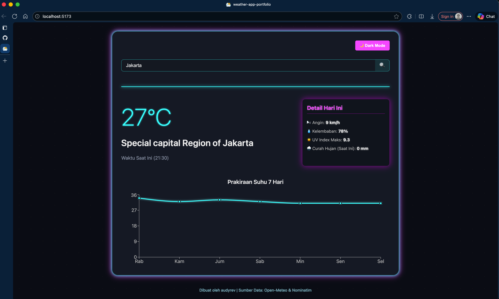
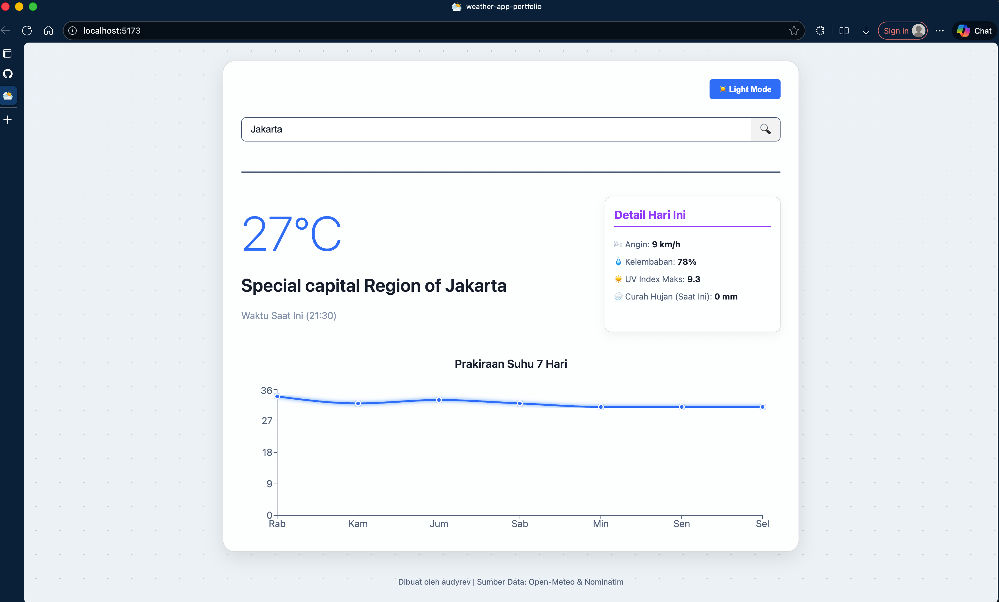

# ⚡ Neon Weather App - React

Aplikasi prakiraan cuaca modern dengan desain futuristik 'Neon Glassmorphism' yang dibangun menggunakan React dan Vite. Dilengkapi dengan toggle Light/Dark Mode dan grafik data 7 hari.

---

## 🎨 Tampilan Proyek

### Dark Mode (Default)

### Light Mode

---

## ✨ Fitur Utama

- **Pencarian Kota Real-time:** Menggunakan Nominatim untuk geocoding.
- **Data Lengkap:** Mengambil data cuaca, suhu, kelembaban, UV Index, dan curah hujan dari Open-Meteo.
- **Grafik 7 Hari:** Visualisasi prakiraan suhu mingguan menggunakan Recharts.
- **Theme Toggle:** Transisi mulus antara mode Gelap (Neon) dan mode Terang (Clean Glass).
- **Desain Responsif.**

## ⚙️ Teknologi yang Digunakan

- **Frontend:** ReactJS
- **Build Tool:** Vite
- **Styling:** CSS3 & CSS Variables
- **Grafik:** Recharts
- **API:** Open-Meteo (Cuaca) dan Nominatim (Geocoding)
